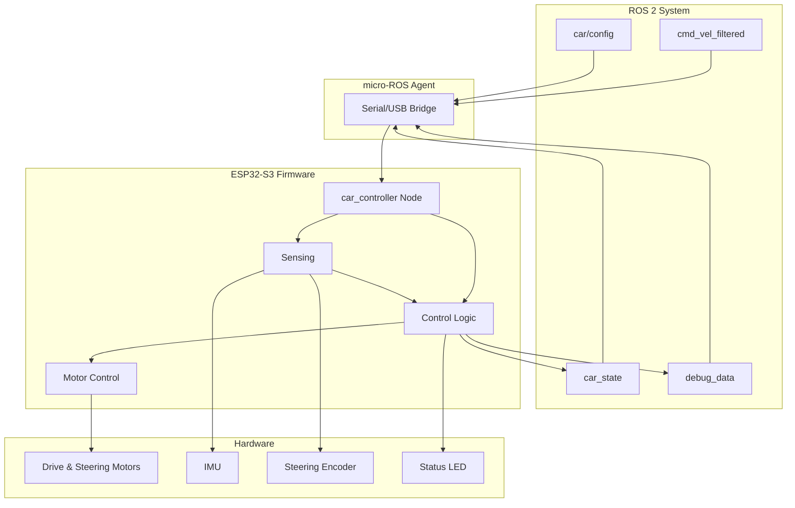

# Micro-controller Firmware

This firmware runs on an ESP32-S3 microcontroller to control a 1/10th scale autonomous vehicle. It provides motor control, steering, IMU sensing, and ROS 2 integration via micro-ROS.

## Hardware Requirements

### Required Components

- **ESP32-S3-DevKitC-1** development board or [CDA1Tenth PCB](docs/10th_Scale_Board.drawio.png)
- **TMC5160 Stepper Drivers** (3x):
  - One for steering motor
  - One for left drive motor
  - One for right drive motor
- **LSM6DSO IMU** sensor (6-DOF accelerometer/gyroscope)
- **Motors**: Stepper motors for drive and steering
- **Power Supply**: Appropriate voltage/current for motors and ESP32
- **USB-C Cable**: For programming and micro-ROS communication

### Pin Connections

The firmware uses the following GPIO pins on the ESP32-S3:

| Pin                  | Function        | Description                                                        |
| -------------------- | --------------- | ------------------------------------------------------------------ |
| **SPI Bus**          |                 |                                                                    |
| IO 11                | MOSI            | SPI Master Out Slave In                                            |
| IO 12                | SCK             | SPI Clock                                                          |
| IO 13                | MISO            | SPI Master In Slave Out                                            |
| **Chip Select Pins** |                 |                                                                    |
| IO 14                | CS_IMU          | Chip select for LSM6DSO IMU                                        |
| IO 39                | CS_RIGHT        | Chip select for right motor TMC5160 (TMC 5160 (0))                 |
| IO 40                | CS_LEFT         | Chip select for left motor TMC5160 (TMC 5160 (1))                  |
| IO 41                | CS_STEER        | Chip select for steering motor TMC5160 (TMC 5160 (2))              |
| **Control Pins**     |                 |                                                                    |
| IO 4                 | EN_PIN          | Motor enable pin                                                   |
| IO 18                | STEERING_SENSOR | Steering angle sensor (analog input)                               |
| IO 37                | LED_PIN         | Status LED                                                         |
| **Other Pins**       |                 |                                                                    |
| IO 0                 | BOOT            | Boot mode selection (normally floating, can be pulled low with S2) |
| EN                   | RESET           | Reset pin (normally pulled up, can be pulled low with S1)          |
| IO 1-2               | ESTOP           | Emergency stop pins (connected to TMC5160 estop)                   |
| IO 17                | BATTERY_VOLTAGE | Battery voltage monitoring (1:8 voltage divider)                   |
| IO 19-20             | USB             | USB connection pins                                                |

> **Note:** A detailed PCB diagram (`10th_Scale_Board.drawio.png`) is available in the `docs/` folder showing the complete board layout, pin connections, and component placement.

## Building and Running

0. Install Platform IO using the following installation [guide](https://docs.platformio.org/en/latest/integration/ide/vscode.html#installation)

1. Build the project:

   ```bash
   pio run
   ```

2. Use a USB cable to connect your laptop to the micro-controller board's USB-C port

3. Put the ESP32 into the manual bootloader mode ([docs by EXPRESSIF](https://docs.espressif.com/projects/esptool/en/latest/esp32/advanced-topics/boot-mode-selection.html#manual-bootloader)).

4. Upload to your ESP32:

   ```bash
   pio run --target upload
   ```

5. Monitor serial output:

   ```bash
   pio device monitor
   ```

## micro-ROS Agent Setup

The firmware communicates with ROS 2 through a micro-ROS agent that must be running on your computer. The agent bridges the serial connection between the ESP32 and your ROS 2 network.

### Quick Start

A startup script is provided (`micro-ros-startup.sh`) that launches the agent with the correct settings:

```bash
./micro-ros-startup.sh
```

### Manual Setup

If you need to run the agent manually or on a different system:

1. **Install micro-ROS Agent** (if using Vulcanexus distribution):

   ```bash
   source /opt/vulcanexus/humble/setup.bash
   ```

2. **Identify the serial port**:

   - **Linux**: Usually `/dev/ttyACM0` or `/dev/ttyUSB0`
   - **Windows**: Usually `COM3`, `COM4`, etc. (check Device Manager)
   - **macOS**: Usually `/dev/cu.usbmodem*` or `/dev/tty.usbmodem*`

3. **Run the agent**:

   ```bash
   ros2 run micro_ros_agent micro_ros_agent serial --dev <PORT> --baudrate 921600 -v6
   ```

   Example for Linux:

   ```bash
   ros2 run micro_ros_agent micro_ros_agent serial --dev /dev/ttyACM0 --baudrate 921600 -v6
   ```

   Example for Windows (using WSL or native):

   ```bash
   ros2 run micro_ros_agent micro_ros_agent serial --dev COM3 --baudrate 921600 -v6
   ```

### Verifying Connection

Once the agent is running and the ESP32 is powered on:

- The ESP32 LED should turn **ON** (solid) when connected
- You should see connection messages in the agent terminal
- You can verify topics are available:
  ```bash
  ros2 topic list
  ```
  You should see `/car/car_state` and `/car/debug_data` topics.

## ROS 2 Topics and Messages

The `car_controller` node communicates via the following ROS 2 topics:

### Subscriptions

| Topic               | Message Type               | Description                             | Rate                          |
| ------------------- | -------------------------- | --------------------------------------- | ----------------------------- |
| `/cmd_vel_filtered` | `geometry_msgs/Twist`      | Velocity commands (linear.x, angular.z) | Variable                      |
| `/car/config`       | `car_config_msg/CarConfig` | Configuration parameters                | 1 Hz (from car_odometry node) |

**`/cmd_vel_filtered` (geometry_msgs/Twist):**

- `linear.x`: Forward/backward velocity in m/s
- `angular.z`: Rotational velocity in rad/s
- **Safety**: Commands timeout after 200ms if no new command is received (car stops)

**`/car/config` (car_config_msg/CarConfig):**

- `wheelbase`: Distance between front and rear axles (meters)
- `track_width`: Distance between left and right wheels (meters)
- `wheel_radius`: Wheel radius (meters)
- `encoder_offset`: Steering encoder offset (degrees)
- `max_steering_angle`: Maximum steering angle (degrees)
- `max_rpm`: Maximum motor RPM

### Publications

| Topic             | Message Type                 | Description                                | Rate  |
| ----------------- | ---------------------------- | ------------------------------------------ | ----- |
| `/car/car_state`  | `car_state_msg/CarState`     | Complete car state (IMU, motors, steering) | 20 Hz |
| `/car/debug_data` | `std_msgs/Float32MultiArray` | Debug information array                    | 2 Hz  |

**`/car/car_state` (car_state_msg/CarState):**

- `header`: ROS 2 header with timestamp and frame_id ("base_link")
- `accel_x/y/z`: Accelerometer data (m/s²)
- `gyro_x/y/z`: Gyroscope data (rad/s)
- `speed`: Current car speed (m/s)
- `steering_angle`: Actual steering angle (degrees)
- `right_motor_rpm`: Right motor RPM
- `left_motor_rpm`: Left motor RPM

**`/car/debug_data` (std_msgs/Float32MultiArray):**

- Array of 20 float values containing debug information (see Debug Data section below)

### Viewing Topics

To monitor the car state:

```bash
ros2 topic echo /car/car_state
```

To send velocity commands:

```bash
ros2 topic pub --once /cmd_vel_filtered geometry_msgs/msg/Twist "{linear: {x: 0.5, y: 0.0, z: 0.0}, angular: {x: 0.0, y: 0.0, z: 0.2}}"
```

## System Architecture

The firmware implements a multi-timer control system with ROS 2 integration via micro-ROS:



### Control Loops

1. **Control Timer** (20ms / 50 Hz)

   - Processes velocity commands
   - Calculates steering angles and motor speeds
   - Updates motor control loops
   - Updates IMU sensor readings

2. **Kinematics Timer** (50ms / 20 Hz)

   - Publishes car state to `/car/car_state`
   - Includes IMU data, motor RPMs, steering angle

3. **Debug Timer** (500ms / 2 Hz)
   - Publishes debug data array to `/car/debug_data`
   - Includes system health, timing, and diagnostic information

### Data Flow

The diagram above shows the complete system architecture. Key data flows:

- **Command Flow**: `/cmd_vel_filtered` → micro-ROS Agent → ESP32 → Motor Control
- **Configuration Flow**: `/car/config` → micro-ROS Agent → ESP32 → Parameter Updates
- **State Flow**: ESP32 Sensors → Control System → `/car/car_state` → ROS 2 Network
- **Debug Flow**: ESP32 Diagnostics → Debug Timer → `/car/debug_data` → ROS 2 Network

### Connection States

The firmware manages connection state through a state machine:

- **WAITING_AGENT**: Waiting for micro-ROS agent to be available
- **AGENT_AVAILABLE**: Agent detected, creating ROS entities
- **AGENT_CONNECTED**: Connected and operating normally
- **AGENT_DISCONNECTED**: Connection lost, cleaning up

## LED Status Codes

The ESP32 board LED (IO 37) provides visual feedback about the system status:

| LED Pattern              | Meaning                                                |
| ------------------------ | ------------------------------------------------------ |
| **1 flash**              | Waiting for USB serial connection                      |
| **2 flashes**            | Initial setup complete                                 |
| **3 flashes**            | Sensor initialization failed OR connection established |
| **4 flashes**            | Failed to create ROS entities (retrying)               |
| **5 flashes**            | micro-ROS agent disconnected                           |
| **6 flashes**            | micro-ROS transport initialized                        |
| **7 flashes**            | Main loop started                                      |
| **8 flashes**            | Waiting for micro-ROS agent                            |
| **Solid ON**             | Connected and operating normally                       |
| **Solid OFF**            | Not connected or error state                           |
| **Continuous 2 flashes** | Fatal ROS error (system halted)                        |

## Configuring the Car Controller

The `car_controller` node on the ESP32 receives its configuration from the `car_odometry` node via the `/car/config` topic. To configure parameters such as `encoder_offset`, `wheel_radius`, `wheelbase`, `track_width`, `max_steering_angle`, and `max_rpm`, you need to set them in the `car_odometry` node.

For detailed instructions on how to configure the `car_odometry` node and set parameters like `encoder_offset`, please refer to the [car_odometry README](https://github.com/Michael7371/cda1tenth-bringup/blob/develop/car_odom_node/README.md).

The `car_odometry` node publishes configuration messages to `/car/config` at 1 Hz, which the `car_controller` node subscribes to and uses to update its internal parameters.

### Quick Reference

The `encoder_offset` parameter is particularly important for accurate steering control. It compensates for the initial encoder position and should be calibrated for your specific hardware setup. Other key parameters include:

- `wheel_radius`: Wheel radius in meters (default: 0.0325)
- `wheelbase`: Distance between front and rear axles in meters (default: 0.185)
- `track_width`: Distance between left and right wheels in meters (default: 0.15)
- `encoder_offset`: Steering encoder offset in degrees (default: 187.5)
- `max_steering_angle`: Maximum steering angle in degrees (default: 30.0)
- `max_rpm`: Maximum motor RPM (default: 300.0)

See the [car_odometry README](https://github.com/Michael7371/cda1tenth-bringup/blob/develop/car_odom_node/README.md) for complete parameter documentation and configuration instructions.

## Installing Custom Message Packages

The firmware uses custom ROS 2 message packages (`car_state_msg` and `car_config_msg`) that need to be built in your ROS 2 workspace.

1. Navigate to your ROS 2 workspace:

   ```bash
   # If you don't have a workspace, create one:
   mkdir -p ~/ros2_ws/src
   cd ~/ros2_ws/src
   ```

2. Copy the message packages from `extra_packages/` to your workspace:

   ```bash
   # Copy car_state_msg and car_config_msg to your workspace src directory
   ```

3. Resolve dependencies:

   ```bash
   cd ~/ros2_ws
   rosdep install --from-paths src --ignore-src -r -y
   ```

4. Build the packages:

   ```bash
   colcon build --packages-select car_state_msg car_config_msg
   ```

5. Source your workspace:

   ```bash
   source install/local_setup.bash
   ```

## Debug Data

The `/car/debug_data` topic publishes a Float32MultiArray with 20 elements containing diagnostic information:

| Index | Description             | Units                         |
| ----- | ----------------------- | ----------------------------- |
| 0     | Status flag             | 1.0 = active                  |
| 1     | Milliseconds timestamp  | ms                            |
| 2     | Accelerometer X         | m/s²                          |
| 3     | Accelerometer Y         | m/s²                          |
| 4     | Accelerometer Z         | m/s²                          |
| 5     | Gyroscope X             | rad/s                         |
| 6     | Gyroscope Y             | rad/s                         |
| 7     | Gyroscope Z             | rad/s                         |
| 8     | Car speed               | m/s                           |
| 9     | Steering angle          | degrees                       |
| 10    | Connection state        | 0-3 (see System Architecture) |
| 11    | Free heap memory        | bytes                         |
| 12    | Total heap size         | bytes                         |
| 13    | Command linear.x        | m/s                           |
| 14    | Command angular.z       | rad/s                         |
| 15    | Time since last command | ms                            |
| 16    | Time offset (ROS sync)  | ms                            |
| 17    | Right motor RPM         | RPM                           |
| 18    | Left motor RPM          | RPM                           |
| 19    | CPU frequency           | MHz                           |

To view debug data:

```bash
ros2 topic echo /car/debug_data
```

## Troubleshooting

### Agent Not Connecting

**Symptoms**: LED stays off or flashes 8 times repeatedly, no topics visible in ROS 2

**Solutions**:

1. Verify the micro-ROS agent is running:

   ```bash
   ros2 node list
   ```

   You should see the agent node.

2. Check the serial port:

   - Verify the USB cable is connected
   - Check the port name matches in the agent command
   - Try a different USB port or cable

3. Check baud rate: Ensure agent is using 921600 baud

4. Verify ESP32 is powered and booted properly

5. Check serial monitor for error messages:

   ```bash
   pio device monitor
   ```

### Motors Not Responding

**Symptoms**: Car doesn't move when commands are sent

**Solutions**:

1. Check motor power supply is connected and adequate
2. Verify TMC5160 drivers are properly connected (SPI, CS pins)
3. Check enable pin (IO 4) is properly configured
4. Verify motor wiring (phases, power)
5. Check serial monitor for motor-related errors
6. Verify `/cmd_vel_filtered` topic is receiving messages:

   ```bash
   ros2 topic echo /cmd_vel_filtered
   ```

### IMU Not Initializing

**Symptoms**: LED flashes 3 times at startup, IMU data is zero

**Solutions**:

1. Verify IMU is connected to SPI bus
2. Check CS_IMU pin (IO 14) connection
3. Verify IMU power supply
4. Check SPI bus connections (MOSI, MISO, SCK)
5. Try re-seating the IMU module

### Serial Port Issues

**Symptoms**: Cannot upload firmware or connect to agent

**Solutions**:

1. **Windows**: Install USB-to-Serial drivers (CP210x or CH340)
2. **Linux**: Add user to dialout group:

   ```bash
   sudo usermod -a -G dialout $USER
   # Log out and back in
   ```

3. Check port permissions:

   ```bash
   ls -l /dev/ttyACM0
   ```

4. Try different USB cable (some cables are power-only)
5. Check if another program is using the port

### Build Errors

**Symptoms**: `pio run` fails

**Solutions**:

1. Update PlatformIO:

   ```bash
   pio upgrade
   ```

2. Clean and rebuild:
   ```bash
   pio run --target clean
   pio run
   ```
3. Clean micro-ROS build:
   ```bash
   pio run --target clean_microros
   pio run
   ```
4. Verify all dependencies in `platformio.ini` are accessible
5. Check internet connection (needed for first-time dependency download)

### ROS 2 Topics Not Appearing

**Symptoms**: Agent connected but topics not visible

**Solutions**:

1. Verify workspace is sourced:
   ```bash
   source ~/ros2_ws/install/local_setup.bash
   ```
2. Check topic list:
   ```bash
   ros2 topic list
   ```
3. Verify custom message packages are built and sourced
4. Check agent is using correct ROS 2 distribution (Humble)
5. Restart the agent

### Steering Not Accurate

**Symptoms**: Steering angle doesn't match commands

**Solutions**:

1. Calibrate `encoder_offset` parameter (see Configuration section)
2. Verify steering sensor (IO 18) is connected
3. Check steering motor wiring and power
4. Verify gear ratio matches hardware (55:12 default)
5. Check for mechanical binding or resistance

### Command Timeout Issues

**Symptoms**: Car stops unexpectedly after 200ms

**Solutions**:

1. Verify command publishing rate is sufficient (should be >5 Hz)
2. Check network/agent latency
3. Verify `/cmd_vel_filtered` topic is being published:
   ```bash
   ros2 topic hz /cmd_vel_filtered
   ```
4. Check for message queue issues in the agent

### Getting Help

If issues persist:

1. Check serial monitor output for detailed error messages
2. Review LED status codes to identify the failure point
3. Verify all hardware connections match the pin table
4. Check the [micro-ROS documentation](https://micro.ros.org/)
5. Review the [car_odometry README](https://github.com/Michael7371/cda1tenth-bringup/blob/develop/car_odom_node/README.md) for related issues

